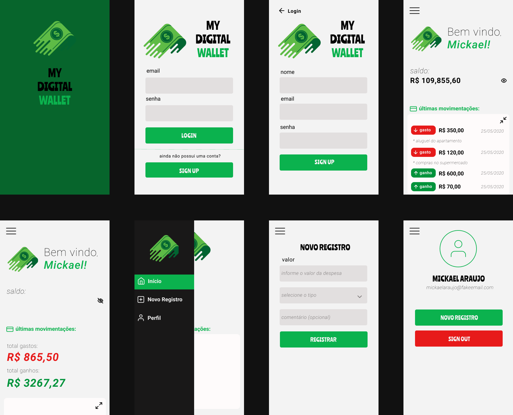

# My Digital Wallet

Aplicação mobile para registrar gastos (ou ganhos) diários.

## Telas

## Tecnologias Utilizadas:

1. [React Native](https://reactnative.dev/)
2. [Firebase](https://firebase.google.com/)

## Outras ferramentas utilizadas:

* [styled components](https://styled-components.com/)
* [async storage](https://github.com/react-native-community/async-storage)
* [react navigation](https://reactnavigation.org/)
* [react-native-vector-icons](https://github.com/oblador/react-native-vector-icons)
* [date-fns](https://github.com/date-fns/date-fns)
* [date-time-picker](https://github.com/react-native-community/datetimepicker)
* [react-native-picker-select](https://github.com/lawnstarter/react-native-picker-select)

## Como executar:

obs: você deve ter a SDK do Android instalado na sua máquina

1. clone esse repositório
2. execute `npm install` ou `yarn` para instalar as dependências
3. execute `npx react-native run-android` para executar o projeto
